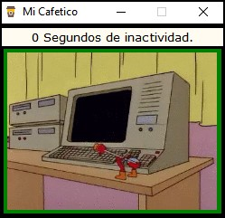

# MiCafetico

MiCafetico es gratuito, válido para Windows 10 y con él conseguiremos que nuestro sistema detecte una pulsación de tecla cada 59 segundos, una idea sencilla pero que nos puede dar mucho juego.

Gracias a esta sencilla e ingeniosa idea, nuestro sistema operativo creerá que estamos delante de él pulsando una tecla cada 59 segundos, por lo que en ningún caso activará los protocolos y servicios vinculados a la inactividad, esto nos puede ayudar tanto en entornos domésticos como profesionales.

**consiguiendo así nuestro objetivo.**

